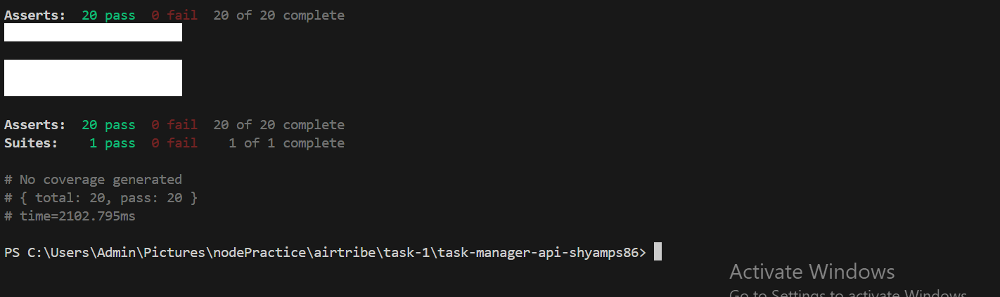

Application overview:

1. Routes:
    - Routes define the API endpoints and handle incoming HTTP requests.
    - Each route is mapped to a controller function.
    - Example: A GET request to `/api/v1/tasks` is routed to the corresponding controller function.

2. Controllers:
    - Controllers act as intermediaries between the routes and the services.
    - They handle request validation, process input data, and call the appropriate service methods.
    - Example: The `getAllTasks` controller function processes the request and invokes the `TaskService` to retrieve tasks.

3. Services:
    - Services contain the business logic of the application.
    - They interact with repositories to fetch or manipulate data and return the results to the controllers.
    - Example: The `TaskService` fetches tasks from the `TaskRepository` and applies any necessary business rules.

4. Repositories:
    - Repositories handle direct interactions with the database but here we have an in memeory array.
    - They provide an abstraction layer for data access, ensuring that the service layer is not tightly coupled to the database implementation.
    - Example: The `TaskRepository` performs CRUD operations on the tasks collection in the database.

1. A client sends a GET request to `/api/v1/tasks`.
2. The route for `/api/v1/tasks` forwards the request to the `getAllTasks` controller.
3. The `getAllTasks` controller calls the `TaskService` to retrieve the list of tasks.
4. The `TaskService` interacts with the `TaskRepository` to fetch the tasks from the in-memeory.
5. The retrieved tasks are returned to the client as a response.

This ensures modularity, scalability, and ease of testing.

list of apis endpoints going to use.

GET `/api/v1/tasks` - Retrieve all tasks.

GET `/api/v1/tasks?completed=true` - Retrieve all tasks that are marked as completed.

GET `/api/v1/tasks?completed=false` - Retrieve all tasks that are not completed.

POST `/api/v1/tasks` - Create a new task.

GET `/api/v1/tasks/:id` - Retrieve a specific task by ID.

PATCH `/api/v1/tasks/:id` - Update a specific task by ID.

DELETE `/api/v1/tasks/:id` - Delete a specific task by ID.

test cases result:
<!-- changed the test.file according to my api endpoints like tasks/ ---> api/v1/tasks -->
